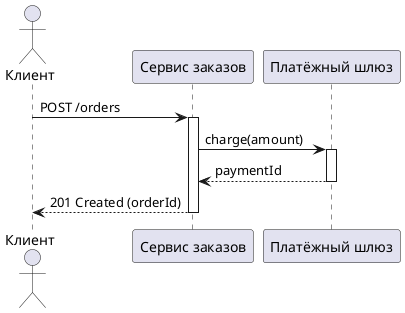
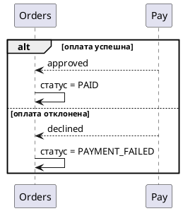
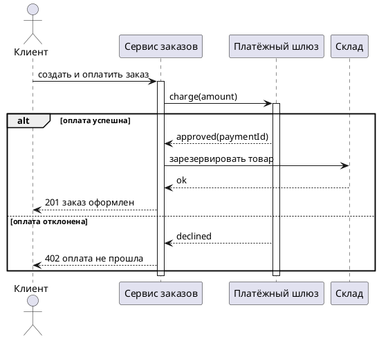
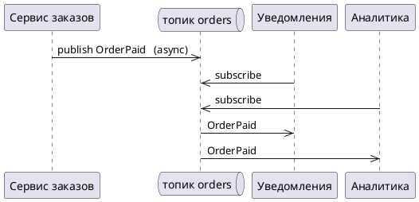

# Модуль 33 — Sequence diagram

## Зачем этот модуль

Вы спроектировали интеграции: REST/gRPC/GraphQL (модули 29–31) и асинхронные события (модуль 32). Теперь нужно **показать взаимодействие во времени** — кто кому какое сообщение шлёт, в каком порядке, что синхронно/асинхронно, как обрабатываются ветвления и ошибки. Для этого служит **UML sequence diagram** (диаграмма последовательности).

Sequence diagram — ключевой артефакт аналитика для проектирования взаимодействия: она превращает текстовый сценарий (use case, модуль 07) в точную последовательность вызовов между участниками. На собеседовании middle+ спрашивают: элементы sequence, чем sync-сообщение отличается от async, что такое фреймы `alt/opt/loop/par`, и когда выбрать sequence, а не activity/BPMN.

---

## 1. Что такое sequence diagram

Sequence diagram показывает **обмен сообщениями между участниками во времени**. Время идёт сверху вниз, участники — слева направо.

> Sequence отвечает на вопрос «**как именно** компоненты взаимодействуют в этом сценарии»: порядок вызовов, синхронность, ответы. Это динамика конкретного сценария, а не структура системы.

---

## 2. Элементы

| Элемент | Нотация | Смысл |
|---------|---------|-------|
| **Участник / lifeline** | прямоугольник + вертикальная линия | объект/сервис/актор, участвующий в сценарии |
| **Актор** | человечек | внешний инициатор (пользователь, внешняя система) |
| **Sync-сообщение** | сплошная стрелка `──▶` (закрашенная) | вызов с ожиданием ответа |
| **Return** | пунктирная стрелка `┈┈▶` | возврат результата |
| **Async-сообщение** | тонкая открытая стрелка `─▷` | отправка без ожидания (событие, publish) |
| **Активация (activation bar)** | узкий прямоугольник на lifeline | период, когда участник обрабатывает вызов |
| **Self-call** | стрелка на себя | вызов собственного метода |
| **Создание/уничтожение** | стрелка к новому участнику / `X` | жизненный цикл объекта в сценарии |

> Главное различие: **sync** (сплошная стрелка, вызывающий ждёт return) vs **async** (открытая стрелка, не ждёт — публикация события, постановка в очередь, модуль 32). Это критично: на async-сообщении нет «ожидания ответа здесь же».

---

## 3. Фреймы (combined fragments)

Фреймы описывают логику ветвления, опциональности, циклов и параллелизма.

| Фрейм | Назначение |
|-------|------------|
| **alt** | ветвление: альтернативы по условию (if/else) — успех/ошибка |
| **opt** | опционально: блок выполняется при условии (if без else) |
| **loop** | цикл: повтор блока (по коллекции/условию) |
| **par** | параллельно: блоки выполняются одновременно |
| **ref** | ссылка на другую диаграмму (декомпозиция) |
| **break** | прерывание сценария при условии |

> Фреймы — то, чем sequence описывает не «happy path», а реальные сценарии: `alt` для успех/ошибка, `opt` для условных шагов, `loop` для повторов, `par` для параллельных вызовов. Без них диаграмма описывает только идеальный поток.

---

## 4. Синхронный сценарий

Пример: оплата заказа — последовательность синхронных вызовов с ответами и обработкой ошибки.

> Синхронный поток: каждый вызов ждёт return; ветвление успех/ошибка — через `alt`. Это прямая визуализация REST/gRPC-взаимодействия (модули 29–31).

---

## 5. Асинхронный сценарий

При событийной интеграции (модуль 32) вызывающий **не ждёт** — публикует событие и продолжает; потребители реагируют независимо.

> На async-сообщениях (открытая стрелка `->>`) нет немедленного return: продюсер не блокируется, потребители обрабатывают событие позже. Так на диаграмме видна развязка во времени и pub/sub.

---

## 6. Проектирование: из use case в sequence

Sequence — естественное продолжение текстового use case (модуль 07):
- **актор** use case → актор/первый участник sequence;
- **основной поток** → последовательность sync-сообщений (happy path);
- **альтернативные потоки** → `alt`/`opt`;
- **исключения** → ветка ошибки в `alt` или `break`;
- **внешние системы** → отдельные участники (с тайм-аутами/ретраями, модуль 25).

> Связка: use case говорит «что происходит» (шаги), sequence — «кто кому шлёт и в каком порядке». Аналитик переводит шаги UC в сообщения между участниками, добавляя ошибки и внешние вызовы.

---

## 7. Sequence vs activity vs BPMN

| Нотация | Фокус | Когда применять |
|---------|-------|-----------------|
| **Sequence** | взаимодействие **участников** во времени (кто кому шлёт) | проектирование вызовов между компонентами/сервисами, API-взаимодействие |
| **Activity** (м.13) | поток **действий** (workflow), решения, fork/join | алгоритм/логика одного процесса, безотносительно «кто» |
| **BPMN** (м.12) | **бизнес-процесс** с ролями (дорожки), бизнес-аудитория | сквозной бизнес-процесс, согласование с бизнесом |

> Выбор: нужно показать **обмен сообщениями между компонентами** (особенно API/интеграции) → **sequence**; поток действий/алгоритм → activity; бизнес-процесс для бизнеса → BPMN. Sequence — самый «технический» из трёх, ближе всего к реализации взаимодействия.

---

## ⚠️ Подводные камни

- **Только happy path.** Без `alt`/`opt`/`break` диаграмма игнорирует ошибки и альтернативы; добавлять ветки ошибок.
- **Путаница sync/async.** Async-событие нарисовано как sync с ожиданием return → искажает развязку; для событий — открытая стрелка без немедленного ответа.
- **Перегруженная диаграмма.** Слишком много участников/сообщений на одной — нечитаемо; декомпозировать через `ref`.
- **Нет внешних сбоев.** Внешний вызов без тайм-аута/ретрая/ошибки — нереалистично (модуль 25); показать ветку сбоя.
- **Sequence вместо state/structure.** Sequence — про сценарий взаимодействия, не про все состояния (state machine, м.13) и не про структуру (class, м.15).
- **Отсутствие return на sync.** Sync-вызов без возврата результата запутывает; показывать return (пунктир).
- **Подмена BPMN.** Для бизнес-аудитории sequence слишком технична; для бизнес-процесса — BPMN.

---

## 🔗 Связь с другими модулями

- [Модуль 07 — Use Cases](../module-07-use-cases/theory.md): текстовый сценарий → sequence; потоки/исключения → фреймы.
- [Модуль 13 — UML поведенческие](../module-13-uml-behavioral/theory.md): activity/state machine vs sequence — выбор нотации.
- [Модуль 25 — Распределённые системы](../module-25-distributed-systems/theory.md): тайм-ауты/ретраи/саги на sequence.
- [Модуль 31 — SOAP/gRPC/GraphQL](../module-31-soap-grpc-graphql/theory.md): sync-вызовы и стриминг на диаграмме.
- [Модуль 32 — Асинхронная интеграция](../module-32-async-messaging/theory.md): async-сообщения, pub/sub на sequence.

---

## ➡️ Что дальше

Вы умеете моделировать взаимодействие во времени: участники, sync/async-сообщения, активации, return, фреймы `alt/opt/loop/par`, перевод use case в sequence и выбор нотации. В [модуле 34](../module-34-api-security/theory.md) — безопасность интеграций: аутентификация/авторизация, OAuth2/JWT, RBAC, OWASP API Top 10 (которые на sequence отображаются как шаги проверки токена/прав).

Сейчас — 10 задач: от синхронной оплаты и async-событий до фреймов `alt/opt/loop/par`, саги, поиска ошибок в чужой диаграмме, перевода use case в sequence, взаимодействия с внешней системой (тайм-аут/ретрай), выбора нотации и мини-проекта (3 ключевых сценария). Затем 25 вопросов в формате собеседования.

> **Инструмент:** рисуйте в [PlantUML](https://plantuml.com) (`@startuml … @enduml`), [draw.io](https://draw.io) или приводите текстовую нотацию (участники + сообщения вида `A -> B: сообщение`, фреймы `alt/opt/loop/par`), если нет возможности приложить картинку.
