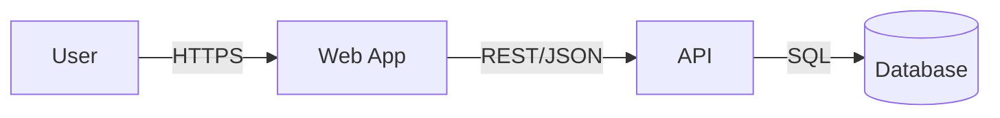

# Модуль 02 — Документирование дизайна (ADR, C4, arc42, Doc-as-Code)

## Зачем этот модуль

Дизайн, который живёт только в голове автора, не существует для команды. Его надо **зафиксировать** так, чтобы новый разработчик понял систему за час, чтобы спорное решение не пересматривали по третьему кругу, и чтобы на интервью вы могли нарисовать систему понятно за 5 минут.

Этот модуль даёт инструментарий документирования: **C4** (как рисовать архитектуру на разных уровнях детализации), **ADR** (как фиксировать решения и их причины), **arc42** (как структурировать дизайн-документ), **Doc-as-Code** (как держать диаграммы в репозитории и ревьюить как код), плюс **sequence-диаграммы** для сценариев. Это не бюрократия — это способ сделать дизайн обсуждаемым и проверяемым.

На design-интервью половина успеха — **понятная схема + проговоренные решения**. C4 и ADR-мышление — ровно про это.

---

## 1. Зачем вообще документировать дизайн

| Документ отвечает на вопрос | Без документа |
|-----------------------------|---------------|
| Как устроена система? (C4) | каждый держит свою модель в голове, они расходятся |
| Почему приняли это решение? (ADR) | через год никто не помнит причин, спор повторяется |
| Где что искать? (arc42) | знание у одного человека = bus factor 1 |
| Как взаимодействуют компоненты в сценарии? (sequence) | интеграционные баги от непонимания потока |

> Документация дизайна — это **актив против забывания и расхождения**. Цель не «бумага ради бумаги», а снижение стоимости понимания и изменения системы. Документ, который никто не читает и который устарел, — хуже, чем его отсутствие.

---

## 2. C4 — четыре уровня масштабирования

**C4** (Simon Brown) — способ рисовать архитектуру как карту с разным зумом. Четыре уровня:

| Уровень | Что показывает | Аудитория |
|---------|----------------|-----------|
| **1. Context** | система как чёрный ящик + пользователи + внешние системы | все, включая бизнес |
| **2. Container** | приложения/сервисы/БД/очереди внутри системы + протоколы | разработчики, архитекторы |
| **3. Component** | крупные компоненты внутри одного контейнера | команда контейнера |
| **4. Code** | классы/схема (обычно генерируется, рисуют редко) | при необходимости |

```
Context   ─ zoom in ─►  Container  ─ zoom in ─►  Component  ─ zoom in ─►  Code
(система в мире)         (что бежит)              (что внутри сервиса)      (классы)
```

> «Container» в C4 ≠ Docker-контейнер. Это **отдельно запускаемая/деплоимая единица**: веб-приложение, API-сервис, БД, брокер, SPA. На интервью почти всегда рисуют **Context** (быстро) и **Container** (основная HLD-схема). Главное правило — **не смешивать уровни** на одной диаграмме.

---

## 3. ADR — Architecture Decision Record

**ADR** — короткая запись об одном значимом архитектурном решении: контекст, варианты, выбор, последствия. Хранится в репозитории (`docs/adr/0001-*.md`), нумеруется, не редактируется задним числом (новое решение → новый ADR со статусом «supersedes»).

```
# ADR-0007: Хранилище для сессий — Redis

## Статус
Принято (2026-06-27)   [Предложено | Принято | Отклонено | Заменено ADR-XXXX]

## Контекст
Нужно хранить сессии 2 млн активных пользователей, TTL 30 мин,
чтение на каждый запрос (~30k RPS), переживать рестарт приложения.

## Варианты
1. In-memory в приложении — быстро, но не переживает рестарт, не шарится между инстансами.
2. Реляционная БД — переживает, но лишняя нагрузка на основную БД, дороже по latency.
3. Redis — быстрый, TTL из коробки, шарится между инстансами.

## Решение
Redis (вариант 3).

## Последствия
+ низкая latency, авто-истечение по TTL, общий для всех инстансов.
− новый компонент в эксплуатации; при падении Redis — разлогин (митигируем репликой).
```

| Поле | Зачем |
|------|-------|
| **Контекст** | силы и ограничения, в которых принималось решение |
| **Варианты** | альтернативы — доказательство, что выбор осознанный |
| **Решение** | что выбрали |
| **Последствия** | плюсы И минусы (минусы обязательны) |

> ADR фиксирует **«почему», а не «как»**. Главная ценность — записанные **альтернативы и последствия**: через год они объясняют, почему система такая, и не дают пересматривать решение по кругу. Статусы делают журнал решений живым: старое решение не стирают, а помечают «заменено».

---

## 4. arc42 — структура дизайн-документа

**arc42** — переносимый шаблон архитектурной документации из 12 разделов. Не обязательно заполнять все — берут нужные под систему.

| # | Раздел | Суть |
|---|--------|------|
| 1 | Введение и цели | задачи, ключевые требования, качества |
| 2 | Ограничения | технические/организационные рамки |
| 3 | Контекст и границы | C4 Context: с кем взаимодействует |
| 4 | Стратегия решения | ключевые подходы кратко |
| 5 | Building blocks | C4 Container/Component: из чего состоит |
| 6 | Runtime | sequence/потоки для важных сценариев |
| 7 | Deployment | где и как разворачивается |
| 8 | Сквозные концепции | безопасность, логирование, обработка ошибок |
| 9 | Решения | ссылки на ADR |
| 10 | Качества | дерево качеств, сценарии качества |
| 11 | Риски и техдолг | известные проблемы |
| 12 | Глоссарий | термины |

> arc42 — это **оглавление**, а не объём работы. Для небольшой системы достаточно разделов 1, 3, 5, 6, 9. Шаблон отвечает на вопрос «где это писать», чтобы дизайн-документ был предсказуем для читателя.

---

## 5. Doc-as-Code

**Doc-as-Code** — документация (включая диаграммы) живёт **в репозитории как текст**, проходит ревью и версионируется вместе с кодом.

- Диаграммы — текстовой нотацией: **PlantUML**, **Mermaid**, **Structurizr** (DSL для C4).
- Изменения дизайна — в pull request, ревьюятся как код.
- Документ всегда соответствует версии кода (в той же ветке).

```
@startuml                          ' PlantUML
actor User
User --> [Web App] : HTTPS
[Web App] --> [API] : REST/JSON
[API] --> [Database] : SQL
@enduml
```



> Главный враг документации — **расхождение с реальностью**. Doc-as-Code лечит это: диаграмма-текст в том же репозитории меняется в одном PR с кодом, ревьюится и не тянет бинарных «картинок из Visio», которые никто не обновляет.

---

## 6. Sequence-диаграммы

**Sequence-диаграмма** показывает взаимодействие компонентов **во времени** для одного сценария: кто кому шлёт сообщения и в каком порядке. Незаменима для распределённых потоков (оплата, регистрация, fan-out).

```
Client -> API: POST /orders
API -> OrderSvc: createOrder()
OrderSvc -> PaymentSvc: charge()
PaymentSvc --> OrderSvc: ok
OrderSvc -> Queue: OrderCreated (event)
OrderSvc --> API: 201 Created
API --> Client: 201 + orderId
```

> C4 показывает **структуру** (статика — что с чем связано), sequence — **поведение** (динамика — что за чем происходит). На интервью sequence уместен в deep dive, когда надо показать порядок шагов, async-границы и точки отказа сценария.

---

## ⚠️ Подводные камни

- **Смешение уровней C4** на одной диаграмме (внешние системы + классы вместе) — теряется читаемость; один уровень = одна диаграмма.
- **«Container» = Docker.** В C4 container — деплоимая единица (сервис, БД, SPA), а не docker-контейнер.
- **ADR без альтернатив и без минусов.** Тогда это не запись решения, а декларация; ценность ADR — именно в отвергнутых вариантах и честных последствиях.
- **Редактирование старых ADR.** Решения не переписывают — добавляют новый ADR со статусом «заменяет».
- **Диаграмма ради диаграммы.** Если она не отвечает на чей-то реальный вопрос — не рисуйте.
- **Устаревшая дока.** Документ, разошедшийся с кодом, дезинформирует; Doc-as-Code и привязка к PR — против этого.
- **Заполнять все 12 разделов arc42** ради полноты — это шаблон-оглавление, берите нужное.
- **Перегруз деталями на интервью.** Сначала Context/Container, в детали — только по запросу.

---

## 🔗 Связь с другими модулями

- [Модуль 01 — Что такое System Design](../module-01-what-is-system-design/theory.md): HLD/LLD, которые и документируем уровнями C4.
- [Модуль 03 — Фреймворк интервью](../module-03-interview-framework/theory.md): C4/sequence как способ изложить ответ.
- [Модуль 04 — Требования](../module-04-design-requirements/theory.md): вход для разделов 1, 10 arc42.
- Системный анализ: UML/нотации, sequence — см. `system-analysis-course` модули 13, 33; C4 как контекст — модуль 06.

---

## ➡️ Что дальше

Вы умеете фиксировать дизайн: C4 (уровни структуры), ADR (решения и причины), arc42 (структура документа), Doc-as-Code (диаграммы в репо), sequence (поведение во времени). В [модуле 03](../module-03-interview-framework/theory.md) — фреймворк design-интервью: как за 45–60 минут пройти путь от размытой задачи до защищённого дизайна, используя в том числе C4 и ADR-мышление.

Сейчас — 10 задач: от построения C4 Context/Container и написания ADR до выбора уровня под аудиторию, поиска ошибок в диаграмме, оформления Doc-as-Code и мини-проекта (мини-HLD: C4 + 2 ADR + sequence). Затем 25 вопросов в формате собеседования.

> **Инструмент:** C4/sequence можно набросать текстом (PlantUML/Mermaid) или псевдо-нотацией прямо в `TaskNN.md`; ADR — по текстовому шаблону из §3. Проверка — по критериям приёмки.
